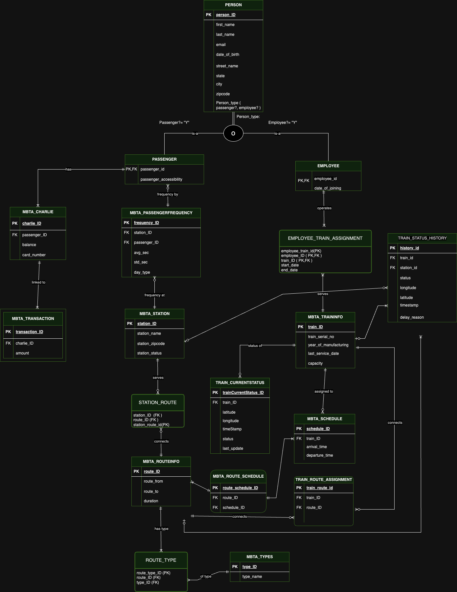

# Railway Management Database System

## Overview

The Train Management Database System is a centralized application designed to streamline train operations and enhance passenger experience within the city of Boston. This system aims to improve upon the current infrastructure.

## ER Diagram

## Features

- **Stored Procedures:** Includes at least 3 stored procedures containing input and output parameters.
- **Triggers:** Includes at least 3 triggers to enforce business rules and maintain data integrity.
- **User-Defined Functions (UDF):** Includes at least 3 user-defined functions to perform specific operations.
- **Views:** Includes at least 3 views, often used for reporting purposes.
- **Table-level CHECK Constraints:** Includes at least 3 table-level CHECK constraints.
- **Computed Columns:** Utilizes computed columns based on a user-defined function (UDF).
- **Column Data Encryption:** Implements column data encryption for enhanced security.
- **Non-clustered Indexes:** Includes at least 3 non-clustered indexes for optimized query performance.
- **Data Visualization:** Utilizes Power BI/Tableau for data visualization.
- **Graphical User Interface (GUI):** Provides a GUI for CRUD operations.

## Dependencies

- **SQL Server Management Studio (SSMS):** Used for database development and management.
- **Angular:** Framework for building web applications.
- **MaterialUI:** A UI component library for Angular applications.
- **Tableau/Power BI:** Utilized for data visualization and analysis.

## Team

- **Nikitha Kambhampati** 
- **Anusha Kadali** 
- **Nidhi Lade**
- **Santoshi Manvita Karuturi** 

## Installation

1. Clone the repository: 
2. Set up the SSMS database.
3. Import the database schema using the provided SQL scripts.
4. Deploy the application to a suitable environment.

## Usage

1. Access the application through the provided URL or launch the executable file.
2. Navigate through the user interface to perform desired actions such as searching schedules or managing Charlie cards.
3. Follow on-screen instructions to complete tasks efficiently.

## Contribution

Contributions to the Train Management Database System are welcome! If you'd like to contribute, please follow these steps:

1. Fork the repository.
2. Create a new branch (`git checkout -b feature/your-feature`).
3. Make your changes.
4. Commit your changes (`git commit -am 'Add some feature'`).
5. Push to the branch (`git push origin feature/your-feature`).
6. Create a new Pull Request.

## License

This project is licensed under the MIT License.

## Acknowledgements

We would like to express our gratitude to Professor Manuel D Montrond, for their support and guidance throughout the development of this project.

